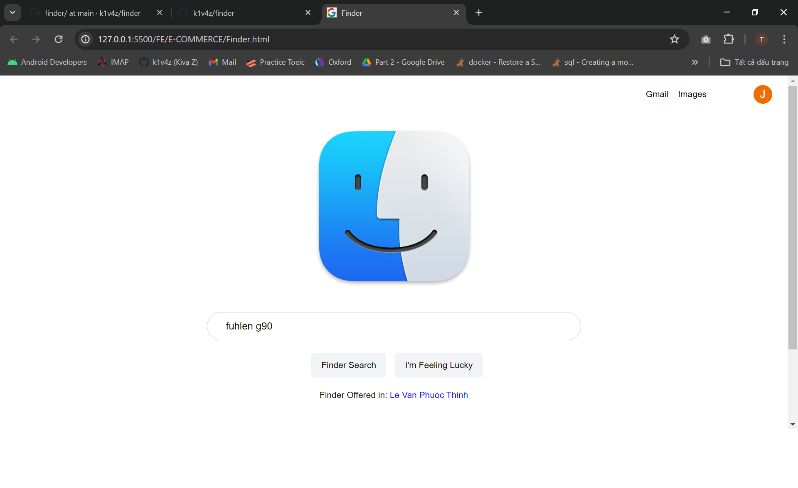
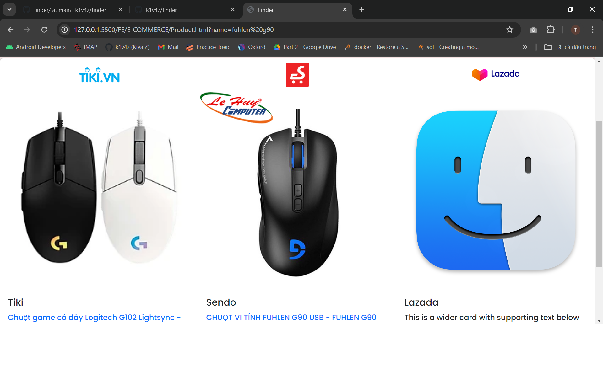
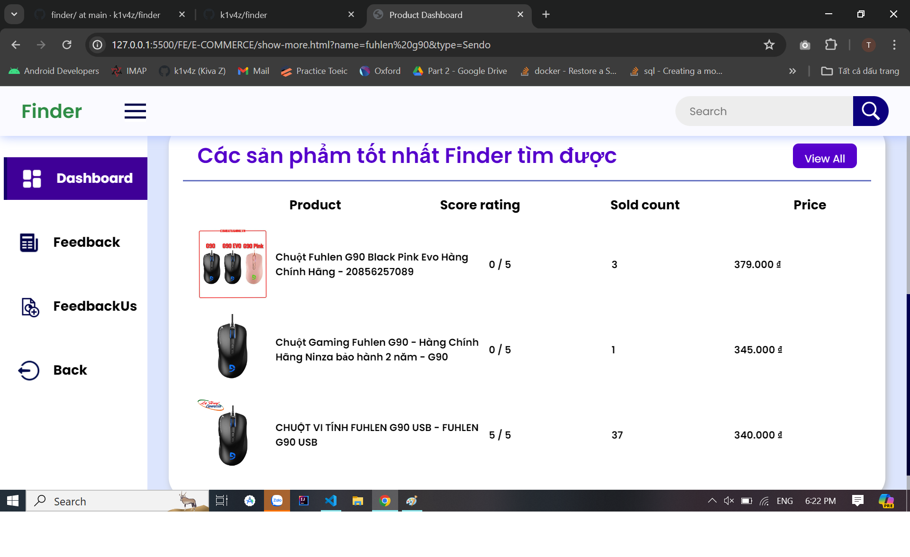

## 🛒 Best product in e-commerce websites
# 📄 Overview
This project is designed to crawl product data from Lazada and Sendo, process the data to determine the best product from each e-commerce website, and provide this information through an API. The crawling process is automated to run daily at 11 PM using a Cron Job. The backend is developed using the Express framework.

# ✨ Features
- 🕸️ Data Crawling: Utilizes Puppeteer to scrape product data from Lazada and Sendo.
- 🧮 Data Processing: Analyzes the crawled data to identify the best product from each website.
- ⏰ Automation: Implements a Cron Job to automate data crawling every day at 11 PM. If data's product don't exist in database, it will write name of product into ProductCrawl.json and crawl at 11h PM. The more user find product the more data increase
- 🌐 API Development: Provides the processed data through an API developed with Express.
# 🛠️ Technologies Used
- 🖥️ Puppeteer: For web scraping and data extraction from Lazada and Sendo.
- 🟢 Node.js: JavaScript runtime environment for building the application.
- ⚙️ Express: Web framework for building the API.
- ⏳ Cron: For scheduling automated tasks.
# 🚀 Getting Started
- 📋 Prerequisites
  - Node.js (v14 or higher)
  - npm (v6 or higher)
# 📥 Installation
- Clone the repository: `https://github.com/k1v4z/finder.git`
- Install dependencies: `npm install`
# ⚙️ Configuration
- Create .env file: `
  PORT: YOUR_PORT
  HOST: YOUR_HOST
`
- Create ProductCrawl.json file follow this format in src folder: `{"name":["túi chống sốc","fuhlen g90","áo thun","áo len"]}`
- Create ServiceAccountKey.json in src folder: Get service account follow guide of firebase
# ▶️ Run
- Run command: `npm run dev`
- Open `Finder.html` and `Open with Live Server`
# Test
- Home 
- Show best product 
- List product 
# 📜 License
This project is licensed under the MIT License - see the LICENSE file for details.
